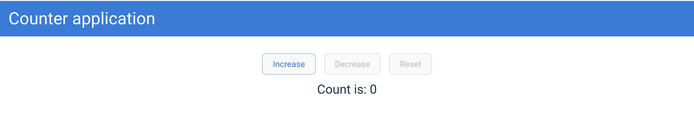

# ⚙️ Functionalities

This project is a React application that allows users to increment and decrement a counter. To increment or decrement the counter, the user can use the available actions on the screen.

There are three actions:

- **Increase**: this action is responsible to increment the counter value when user clicks on this action.
- **Decrease**: this action is responsible to decrement the counter value when user clicks on this action.
- **Reset**: this action is responsible to reset the counter value to the initial value (Zero).

## Business rules

1. When user clicks on the **Increase** button the counter value is increased by one;
2. When user clicks on the **Decrease** button the counter value is decreased by one;
3. When user clicks on the **Reset** button the counter value changed to the initial value (Zero);
4. The count cannot go below Zero
5. If the user is not able to decrement the value, when the count is Zero, so the **Decrease** buttons must be disabled;
6. If the user is not able to reset the value, when the count is Zero, so the **Reset** button must be disabled;
7. The count information must be available all the time;

## Technical information

This project is using [React Context API](https://react.dev/reference/react/createContext) as the state management. In the file [counter-context.tsx](../src/features/counter/counter-context.tsx) you can find all information provided by this context.

## Prototypes

### Initial state

Here you can see the application initial state, the buttons **Decrease** and **Reset** are disabled because the business rules 5 and 6.

### Buttons when count is greater than zero

Here you can see the buttons state when the count is greater than Zero:

